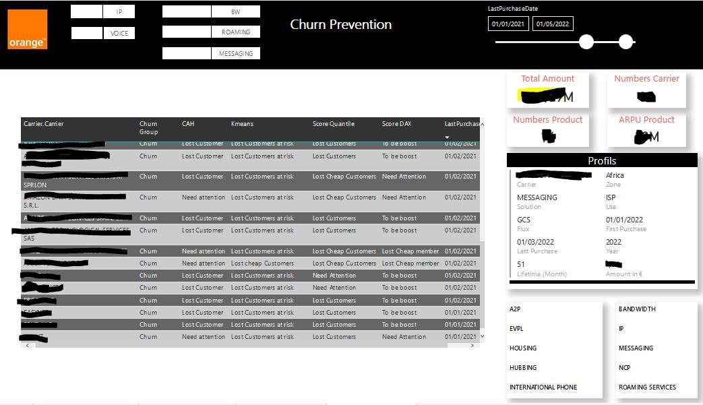
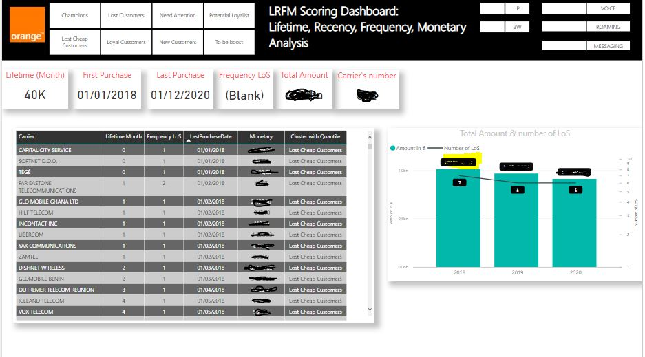
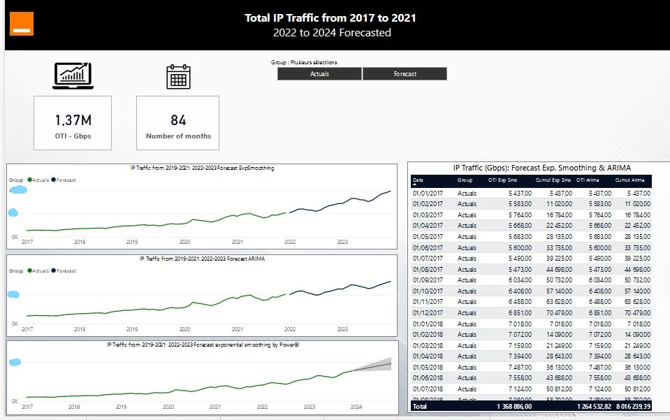
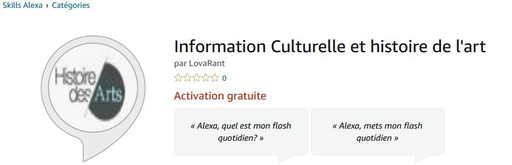
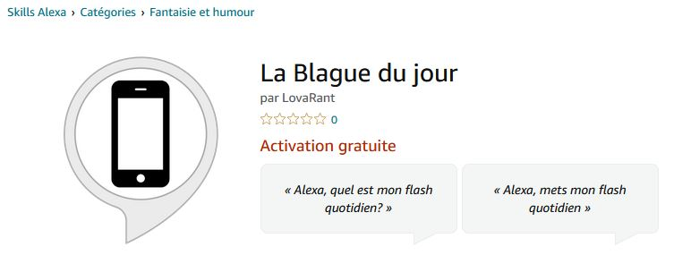

You can see my porfolio on Github and Gitlab. My account Rpubs for R projects.

   {% include button.html text="Tweet it" icon="twitter" link="https://twitter.com/intent/tweet/?url=https://rant95.github.io&text=The%20porfolio%20of%20Lova" color="#0d94e7" %}  

# About me 

You can see my [projects on Github](https://github.com/rant95/) and my [projects on Gitlab](https://gitlab.com/docgero3) .
My account Rpubs for R projects: [https://rpubs.com/lov95](https://rpubs.com/lov95)

👋🏽 Hi, I'm Lova  and I'm Data Scientist in Business Intelligence at International Carriers

🎓 Graduate from CNAM in Network and Telecommunication Master's Degree and I hold a [certificate of specialization in Big data analysis](https://formation.cnam.fr/rechercher-par-discipline/certificat-de-specialisation-analyste-de-donnees-massives-669531.kjsp) and I have recently got a [certificate of specialization in AI](https://formation.cnam.fr/rechercher-par-discipline/certificat-de-specialisation-intelligence-artificielle-1176377.kjsp) at CNAM

🌇 Work in Remote and my office is in Paris
 
📚 Analyze the CRM's opportunities, upselling, churn prevention, customer acquisition, cross-selling, forecast revenues and internet IP traffic with power BI Gitlab CI/CD.
I analyzed as Data Analyst the KPIs data and optimized the quality of service RAN 2G/3G/4G. I used to be an infrastructure project manager designing the engineering of the network room. (chilled water production, electric power generation, fire suppression system).

💻 As for my future, I hope to one day work as Machine Learning Engineer. I use Gitlab CICD https://gitlab.com/docgero3 and Github actions https://github.com/rant95

🏔 In my free time, I enjoy practicing Yoga, Inline Hockey and running. Obviously I enjoy watching movies and TV show.

💪🏽 My strengths are Analytical, leadership, Storytelling, Curiosity, multi-cloud, project management and Team player. I have some certificate on cloud computing such as:

- Azure: AZ-900, DP-900, AI-900 

- Power Platform: PL-900 

- AWS Cloud Practitioner
  
- GCP Associate Cloud Engineer 

# My Projects

## Power BI report

[Gitlab Churn Prevention](https://gitlab.com/docgero3/churn)

[Gitlab LRFM Scoring dashboard](https://gitlab.com/docgero3/customers-segmentation)

[Gitlab IP Traffic Forecast](https://gitlab.com/docgero3/traffic)

## Data Science projects

* [Analysis of tweets Covid19](https://github.com/rant95/Sentiment_analysis_Tweet_covid)- Scala 
Thematic analysis and modeling predicting the sentiment of a tweet on the Covid19 theme in 2020. With Stanford CoreNLP library on Databricks/MongoDB 

* [4G radio sites Classification](https://github.com/rant95/Classification-4G-Mobile-site)- R 
This study will find correlations and atypical cases between 4G cells through variable reduction (PCA) and hierarchical clustering and kmeans 

* [Translation image to image](https://github.com/rant95/Advanced-artificial-intelligence/blob/main/Projet_cyclegan_Monet2photo_v3.ipynb) - Python
CycleGAN transfers styles to images and converting real pictures into Monet or Van Gogh pictures.

* [Generation Face with GAN](https://github.com/rant95/Advanced-artificial-intelligence/blob/main/Project%20generation%20Face%20GAN.ipynb) - Python
Generative Adversarial Networks are used to generate images that never existed before. They learn about the world (objects, animals and so forth) and create new versions of those images that never existed.

* [Music Source Separation](https://github.com/rant95/Separation_audio_source)- Python 
Separation of the audio sources of a music from MUSDB18 with on one side the vocal and on the other the instrumental. Using Neural network architecture on the spectrum with BLSTM layers (model Deep Mask and Open UNMIX).

* [Car Price Prediction](https://github.com/rant95/Car-Price-Prediction) - Scala
Modeling car prices with the available independent variables by a regression model such as linear regression, Random Forest regression, Decision tree regression

* [Identification Dog Breed](https://github.com/rant95/Dog_breed_classification)- Python 
Classification of photos of dogs in 30 categories with a model of prediction Convolutional neuronal Network (CNN) 

* [Dogs vs Cats Classification](https://github.com/rant95/Dogs_vs_Cats_classification/blob/main/dogs_vs_cats.ipynb)- Python 
The objectif is to predict that is a cat or dog with an input image. We take cats_and_dogs _filtered for this classification.

* [News Articles Classification](https://github.com/rant95/All_the_news_Analysis_NLP)- Scala 
LSA/Word2Vec latent semantic analysis of articles in the all-the-News dataset from Kaggle and kmeans classification.

* [Income Prediction Census US](https://github.com/rant95/Challenge-Data-Census-US)- R 
Prediction of the binary variable outcome using different algorithms. 

* [Wine quality prediction](https://github.com/rant95/Wine-quality-prediction) - Python / R
Modeling quality score by a regression model such as linear regression, Random Forest regression, xgboost regression and by classification like Random Forest, Decision Tree, SVM, SGB, XGB, KNN, Logistic Regression

## Bot AI OpenAI

I built a bot AI in JavaScript with openAI API on Discord
[Script Bot AI](https://replit.com/@LovaRant/CustomChatBot#index.js)

This the channel on Discord to test the [bot AI](https://discord.com/channels/1104383378217771058/1104383378674954333)

## Alexa skills

* [Information Culturelle et histoire de l'art (French)](https://www.amazon.fr/dp/B09QCR1528)

* [La Blague du jour (French)](https://www.amazon.fr/dp/B09Q3DDPBH)

